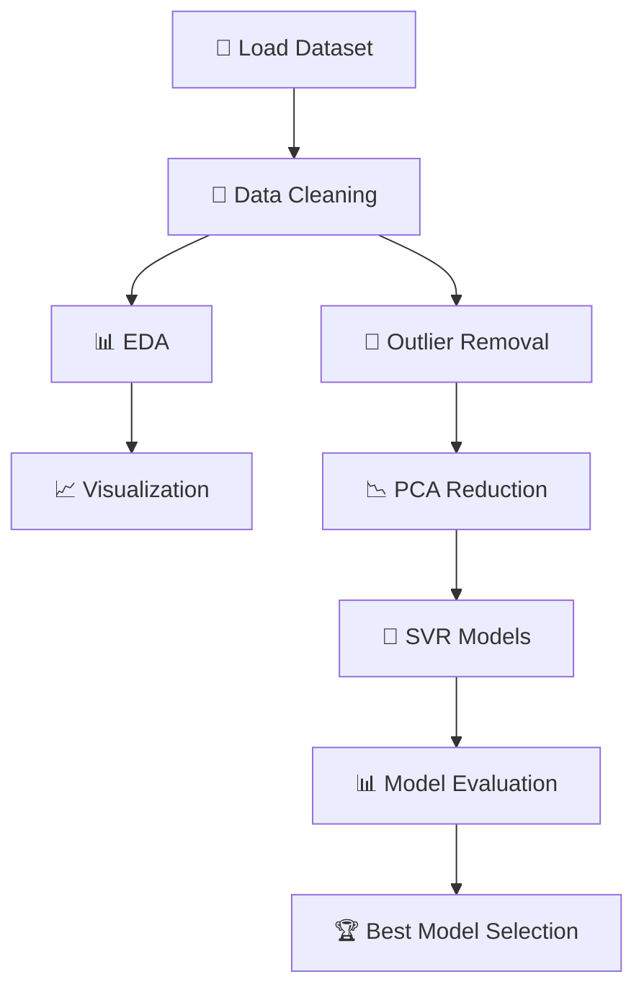

<div align="center">
  
  <br><br>
  
  
  
</div>

---

## <div align="center"><b style="color:#1E40AF">📊 Project Overview</b></div>

The **Housing Price Analysis & Prediction Pipeline** is a complete **end-to-end Machine Learning project** designed to analyze and predict housing prices using the **King County Housing Dataset**.

This project combines:

* 📊 Exploratory Data Analysis (EDA)
* 🧹 Data Cleaning & Outlier Removal
* 📉 Dimensionality Reduction (PCA)
* 🤖 Regression Modeling (SVR)

It delivers **data-driven insights** and identifies the **best-performing model** for price prediction.

<div align="center">
  
  
  
</div>

---

## ✨ **Key Features**

| Feature                | Description                               |
| ---------------------- | ----------------------------------------- |
| 📊 Full EDA Pipeline   | Data loading, cleaning, and visualization |
| 🧹 Outlier Removal     | Z-score filtering for cleaner data        |
| 📉 PCA Reduction       | 90% variance retention                    |
| 🤖 Multiple Models     | SVR (RBF, Linear, Polynomial)             |
| 📊 Model Evaluation    | RMSE-based comparison                     |
| 📈 Rich Visualizations | Heatmaps, histograms, scatter plots       |

---

## 🖥️ **System Pipeline**



---

## 📊 **Dataset Overview**

* 📁 **Dataset**: King County Housing
* 📌 **Records**: 21,613
* 📊 **Features**: 21

### 🎯 Target Variable

* `price` (continuous)

### 🔑 Key Features

* sqft_living
* bedrooms
* bathrooms
* grade
* latitude & longitude

---

## ⚙️ **Pipeline Breakdown**

### 1️⃣ Data Quality Checks

* ✅ No missing values
* ✅ No duplicates
* ✅ Date parsing completed

---

### 2️⃣ Exploratory Data Analysis

* 📊 Histograms + KDE (17 features)
* 📉 Scatter plots (price vs key features)
* 📦 Box plots for outlier detection
* 🔥 Correlation heatmap

---

### 3️⃣ Outlier Removal

* 📌 Method: **Z-score (threshold = 1)**
* ❌ Removed ~96% noisy data
* ✅ Final dataset: **887 clean records**

---

### 4️⃣ Dimensionality Reduction (PCA)

* 📊 Original features: 18
* 📉 Reduced to: **11 components**
* 🎯 Variance retained: **90%**
* 📈 PC1 explains: **31.05%**

---

### 5️⃣ SVR Model Comparison

| Model         | RMSE  | Rank   |
| ------------- | ----- | ------ |
| 🥇 RBF Kernel | 2.349 | Best   |
| 🥈 Polynomial | 2.365 | Second |
| 🥉 Linear     | 2.429 | Third  |

---

## 📈 **Key Insights**

```
🔥 Strongest Correlations:
- sqft_living (≈ 0.7+)
- grade
- sqft_above

⚠️ Outliers:
- Heavy skew in price and lot size

📍 Location Impact:
- lat/long show strong geographic patterns
```

---

## 🧠 **Model Configuration**

```python
# PCA Configuration
PCA_THRESHOLD = 0.90

# SVR Parameters
SVR_C = 100
SVR_EPSILON = 0.1
```

---

## 📂 **Project Structure**

```
housing-price-pipeline/
│
├── data_loading.py
├── eda_visualizations.py
├── outlier_removal.py
├── pca_reduction.py
├── svr_models.py
├── main_pipeline.py
```

---

## 🚀 **Quick Start**

```bash
# 1. Clone the repository
git clone https://github.com/your-username/housing-price-pipeline.git
cd housing-price-pipeline
```

### 📦 Install Dependencies

```bash
pip install pandas numpy matplotlib seaborn scikit-learn
```

### ▶️ Run the Pipeline

```bash
python main_pipeline.py
```

---

## 📊 **Example Output**

```
Original shape: (21613, 18)
PCA Components: 11 (90% variance)

RMSE Scores:
RBF Kernel: 2.3487  ← Best
Polynomial: 2.3654
Linear: 2.4290
```

---

## 🎨 **Visualizations Included**

* 📊 Histograms + KDE
* 📉 Scatter plots
* 📦 Boxplots
* 🔥 Correlation Heatmap
* 📉 PCA Scree Plot
* 🤖 SVR Prediction Plot

---

## 📈 **Performance Highlights**

| Metric           | Value         |
| ---------------- | ------------- |
| Dataset Size     | 21K+ records  |
| Final Clean Data | 887           |
| Best Model       | SVR (RBF)     |
| Accuracy Metric  | RMSE          |
| Pipeline Type    | End-to-End ML |

---

## 🔮 **Future Enhancements**

* 🤖 Deep Learning Models (ANN)
* ⚡ Hyperparameter Optimization
* ☁️ Deployment (Streamlit / Flask)
* 📊 Interactive Dashboards
* 🧠 Feature Engineering Improvements

---

## 👩‍💻 **Author**

<div align="center">
  <a href="https://linkedin.com/in/nour-mohammed-614753278">
    
  </a>
  
</div>

---

## ❤️ **Acknowledgments**

<div align="center">
  
  <br>
  <sub>Built with ❤️ for Machine Learning & Data Analysis</sub>
</div>

<div align="center">
  
</div>
